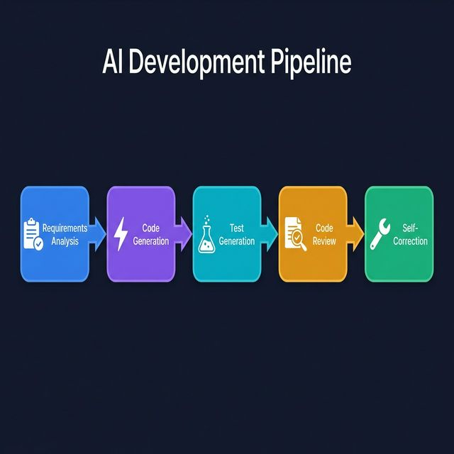

# 📋 SASDS — Project Proposal

> **Single Agent Software Development System**
> An AI-Powered IDE that Democratizes Software Creation

---

## 1. Executive Summary

**SASDS** (Single Agent Software Development System) is a browser-based, AI-powered Integrated Development Environment (IDE) that transforms **natural language descriptions** into **fully functional, production-ready applications**. By leveraging Google's Gemini AI, SASDS eliminates the traditional gap between ideation and implementation — enabling anyone, from business analysts to junior developers, to build software at unprecedented speed.

### The Problem

| Challenge | Impact |
|---|---|
| Building software requires deep technical expertise | Limits innovation to a small talent pool |
| Prototyping is slow and expensive | Delays time-to-market |
| Code quality is inconsistent across teams | Increases maintenance costs |
| Debugging and testing consume 40-60% of dev time | Reduces developer productivity |

### The Solution

SASDS introduces a **single, intelligent AI agent** that handles the entire software development lifecycle:

```
💡 Idea → 📝 Requirements → 🏗️ Code Generation → 🧪 Testing → 🔍 Review → 🚀 Deployment
```

The agent doesn't just generate code — it **understands context**, **streams code in real-time**, **auto-corrects bugs**, and **proactively analyzes** the codebase for security vulnerabilities and quality issues.

---

## 2. Key Features & Value Proposition

### 🎯 Core Capabilities

| Feature | Description | Value |
|---|---|---|
| **Natural Language to Code** | Describe your app in plain English; the AI builds it | Zero-config project scaffolding |
| **Real-Time Streaming** | Watch code being written live, token-by-token | Full transparency into AI decisions |
| **Auto-Pilot Analysis** | Proactive background scanning for bugs, security flaws, and improvements | Continuous code health |
| **Self-Correction Engine** | Automatically fixes failing tests using iterative AI repair loops | Reduced debugging time by up to 80% |
| **Context-Aware Chat Agent** | Ask questions about your code; get answers that understand your project structure | Always-available expert assistant |
| **Code Refinement** | Select any code block and instruct the AI to modify it | Surgical precision edits |
| **Interactive Terminal** | Full PTY-backed terminal in the browser via WebSockets | No need to leave the IDE |
| **VS Code-Like Editor** | Monaco Editor with syntax highlighting for 50+ languages | Familiar, professional editing |
| **File Explorer** | Full file tree with create, rename, delete, and context menus | Complete project management |
| **GitHub Integration** | Sync generated projects directly to GitHub repositories | Seamless version control |

### 🏆 Competitive Differentiators

1. **Single-Agent Architecture** — One unified agent manages the entire workflow, eliminating context fragmentation.
2. **Streaming-First Design** — Users see code being generated in real-time, not just a final output dump.
3. **Closed-Loop Self-Correction** — The agent runs tests, detects failures, and auto-fixes autonomously (up to 3 iterations).
4. **Full IDE Experience** — Not just a code generator; a complete browser-based development environment.

---

## 3. System Architecture


---

## 4. Technology Stack

| Layer | Technology | Purpose |
|---|---|---|
| **Frontend** | React 18, TypeScript, Vite | UI framework & build tooling |
| **Styling** | TailwindCSS, Shadcn/UI (Radix) | Design system & component library |
| **Editor** | Monaco Editor (`@monaco-editor/react`) | VS Code-grade code editing |
| **Terminal** | xterm.js | Browser-based terminal emulation |
| **Backend** | FastAPI (Python 3.11+) | High-performance async API |
| **AI Engine** | Google Gemini 2.5 Flash | Code generation, analysis & chat |
| **Database** | SQLite (metadata), PostgreSQL (optional) | Project metadata & run history |
| **Queue** | Redis + Celery | Background task processing |
| **Containerization** | Docker, Docker Compose | Deployment & orchestration |
| **CI/CD** | GitHub Actions | Automated testing & builds |
| **Version Control** | Git, GitHub API | Code sync & collaboration |

---

## 5. AI-Powered Development Pipeline

SASDS follows a **5-stage agentic pipeline** that mirrors how an expert developer works:



| Stage | Service | What It Does |
|---|---|---|
| **1. Analyze** | Requirements Analyzer | Parses natural language into structured modules, entities, APIs, and tech stack suggestions |
| **2. Generate** | Code Generator (Streaming) | Produces full-stack code files streamed in real-time to the IDE |
| **3. Test** | Test Generator | Creates unit tests and integration tests for the generated code |
| **4. Review** | Code Reviewer | Identifies bugs, security issues, and quality improvements |
| **5. Self-Correct** | Self-Correction Engine | Runs tests → detects failures → auto-fixes code (up to 3 iterations) |

---

## 6. Target Audience & Use Cases

### Primary Users

| Persona | Use Case |
|---|---|
| **Business Analysts** | Transform requirements documents into working prototypes |
| **Junior Developers** | Accelerate learning by seeing expert-level code generated in real-time |
| **Startup Teams** | Rapid MVP development with minimal engineering overhead |
| **Educators** | Demonstrate coding concepts with AI-assisted live coding |
| **Enterprise Teams** | Standardize code generation with consistent quality and patterns |

### Example Scenarios

1. **"Build a REST API for a task management app"** → SASDS generates FastAPI routes, models, CRUD operations, and tests.
2. **"Create a real-time chat application"** → SASDS scaffolds WebSocket handlers, message models, and a frontend interface.
3. **"Analyze this project for security vulnerabilities"** → Auto-Pilot scans all files and returns structured findings.

---

## 7. Roadmap & Future Enhancements

| Phase | Feature | Status |
|---|---|---|
| **v0.1 (Current)** | Core IDE, Code Generation, Streaming, File Management | ✅ Complete |
| **v0.1** | Auto-Pilot, Chat Agent, Code Review | ✅ Complete |
| **v0.1** | Self-Correction Engine, Test Generation | ✅ Complete |
| **v0.1** | Docker Deployment, CI/CD Pipeline | ✅ Complete |
| **v0.2** | Multi-language support (JS/TS, Go, Rust) | 🔜 Planned |
| **v0.2** | Collaborative Editing (multi-user) | 🔜 Planned |
| **v0.3** | Cloud Deployment (AWS/GCP one-click deploy) | 🔜 Planned |
| **v0.3** | Plugin System for custom AI agents | 🔜 Planned |
| **v1.0** | Enterprise SSO, Audit Logs, RBAC | 🔜 Planned |

---

## 8. Licensing

This project is licensed under the **MIT License**, allowing free use, modification, and distribution for both personal and commercial purposes.

---

> *SASDS — Turning ideas into software, one prompt at a time.*
