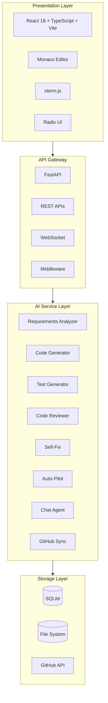
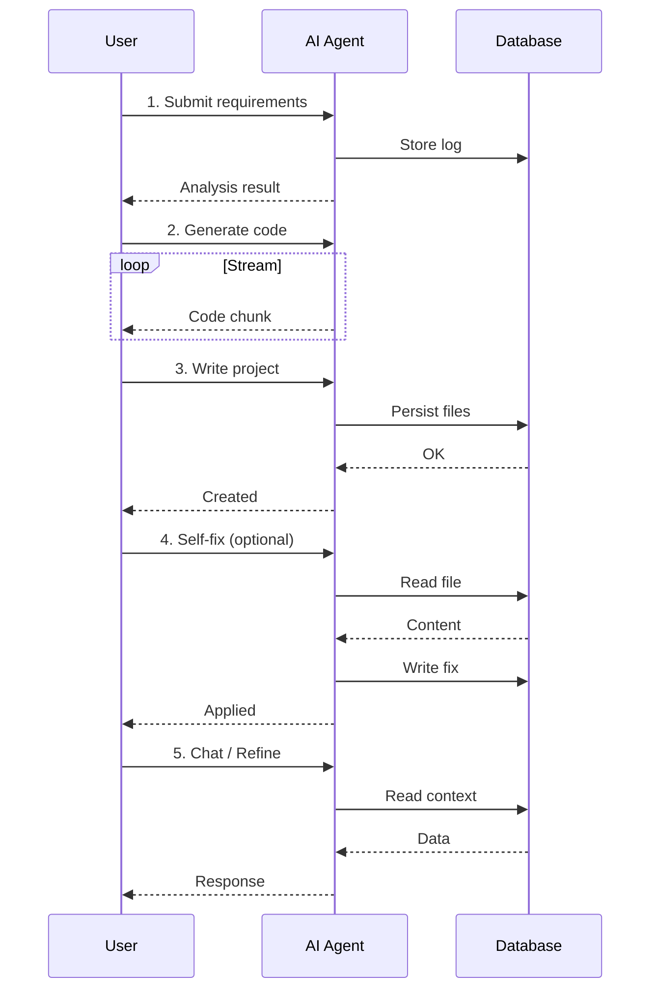
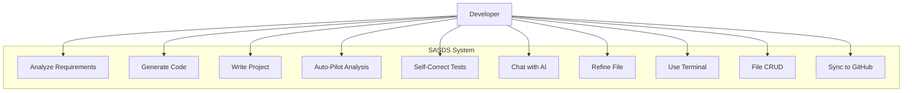
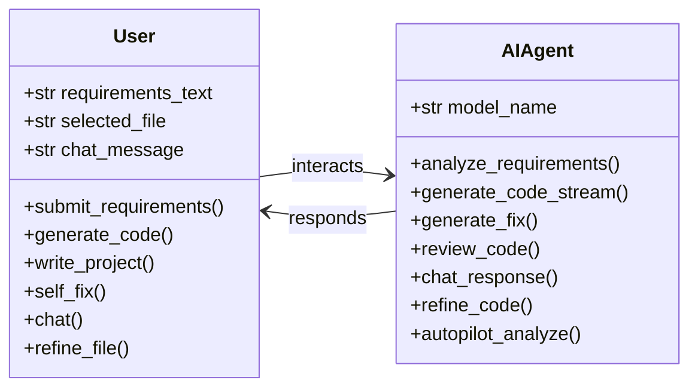
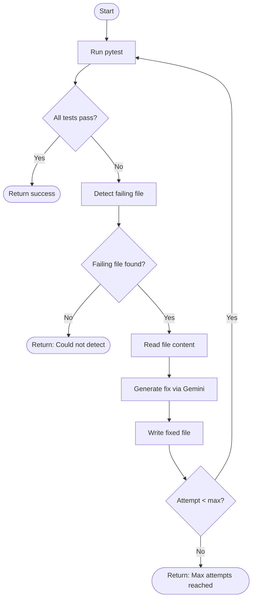

# SASDS — Comprehensive Architecture & Technical Documentation

> **Single Agent Software Development System** — High-Level Documentation

**Version:** 1.0  
**Last Updated:** March 2026

> **Note:** Diagrams use [Mermaid](https://mermaid.js.org/) syntax. They render automatically on GitHub, GitLab, VS Code (with Markdown Preview), and most modern markdown viewers.

---

## Table of Contents

1. [Software Architecture](#1-software-architecture)
2. [Technical Architecture](#2-technical-architecture)
3. [Sequence Diagram](#3-sequence-diagram)
4. [Use Case Diagrams](#4-use-case-diagrams)
5. [Class Diagram](#5-class-diagram)
6. [Algorithms](#6-algorithms)
7. [Implementation Steps](#7-implementation-steps)
8. [Test Cases Table](#8-test-cases-table)
9. [Major Source Code](#9-major-source-code)
10. [Future Value & Usefulness](#10-future-value--usefulness)

---

## 1. Software Architecture

### 1.1 Overview

SASDS is a **full-stack, AI-powered IDE** that transforms natural language requirements into working software. The system follows a **layered architecture** with clear separation of concerns.



### 1.2 Component Responsibilities

| Layer | Components | Responsibility | Status |
|-------|------------|----------------|--------|
| **Frontend** | App Shell, File Explorer, Code Viewer, Terminal, Chat | User interaction, state orchestration, real-time updates | Active |
| **API Gateway** | Routers, Middleware | Request routing, validation, CORS, logging | Active |
| **AI Services** | Gemini client, Code/Test/Review generators | Natural language processing, code generation, analysis | Active |
| **Persistence** | SQLite, File Writer | Run logs, generated project storage | Active |

---

## 2. Technical Architecture

### 2.1 Technology Stack

| Layer | Technologies | Status |
|-------|---------------|--------|
| **Frontend** | React 18, TypeScript 5.6+, Vite 6, TailwindCSS, Radix UI, Monaco Editor, xterm.js | In Use |
| **Backend** | FastAPI 0.109+, Uvicorn, Python 3.9+ | In Use |
| **AI** | Google Gemini 2.5 Flash (`google-generativeai`) | In Use |
| **Database** | SQLite (default) via SQLAlchemy 2 | In Use |
| **Infrastructure** | Docker Compose, PostgreSQL (optional), Redis (optional) | In Use |

### 2.2 Directory Structure

```
SASDS-AI-Automation/
├── backend/
│   ├── app/
│   │   ├── core/           # Config (settings, env vars)
│   │   ├── db/             # SQLAlchemy models, session
│   │   ├── routers/        # 14 API route handlers
│   │   ├── schemas/        # Pydantic request/response models
│   │   ├── services/      # AI integration, business logic
│   │   └── utils/         # file_writer, test_runner
│   ├── generated_projects/  # Output directory for generated code
│   ├── tests/             # Pytest (conftest)
│   └── requirements.txt
├── frontend/
│   ├── src/
│   │   ├── components/    # CodeViewer, FileExplorer, Terminal, ChatInterface
│   │   ├── api/           # HTTP client, streaming
│   │   └── lib/           # stream-parser, file-utils
│   └── cypress/           # E2E tests
├── docs/                  # Documentation
└── docker-compose.yml
```

### 2.3 Data Flow Summary

- **Requirements** → `POST /requirements/analyze` → Gemini → Structured JSON
- **Code Gen** → `POST /code/generate/stream` → Gemini (streaming) → Delimiter protocol
- **Write** → `POST /code/write` → `file_writer` → `generated_projects/{id}/`
- **Self-Fix** → `POST /self/fix` → pytest → detect failing file → Gemini fix → rewrite
- **Auto-Pilot** → `POST /autopilot/analyze` → scan project → Gemini analysis
- **Chat** → `POST /chat/send` → context + history → Gemini response
- **Terminal** → `WS /terminal/ws` → PTY → shell

---

## 3. Sequence Diagram



---

## 4. Use Case Diagrams

### 4.1 Actor–System Interactions



### 4.2 Use Case Summary

| Use Case ID | Use Case Name | Actor | Description | Status |
|-------------|---------------|-------|-------------|--------|
| UC-01 | Analyze Requirements | Developer | Submit NL text, receive structured modules/entities/APIs | Implemented |
| UC-02 | Generate Code | Developer | Stream code generation from requirements | Implemented |
| UC-03 | Write Project | Developer | Persist generated files to disk | Implemented |
| UC-04 | Auto-Pilot Scan | Developer | Full project analysis for bugs/security | Implemented |
| UC-05 | Self-Correct Tests | Developer | Auto-fix failing tests (max 3 attempts) | Implemented |
| UC-06 | Chat with Agent | Developer | Context-aware AI conversation | Implemented |
| UC-07 | Refine File | Developer | Modify a file via NL instructions | Implemented |
| UC-08 | Use Terminal | Developer | Interactive shell via WebSocket | Implemented |
| UC-09 | Manage Files | Developer | Create, rename, delete files | Implemented |
| UC-10 | Sync to GitHub | Developer | Push project to remote repository | Implemented |

---

## 5. Class Diagram



---

## 6. Algorithms

### 6.1 Requirements Analysis Pipeline

```
Algorithm: analyze_requirements
Input: requirements_text (string)
Output: RequirementAnalysisResponse (structured JSON)

1. Build prompt with system instructions and user text
2. Call Gemini API with response_mime_type='application/json'
3. Parse response.text as JSON
4. Validate against RequirementAnalysisResponse schema
5. Return validated object
6. On error: raise HTTPException(500)
```

### 6.2 Streaming Code Generation Protocol

```
Algorithm: stream_code_generation
Input: requirements_text, optional analysis
Output: AsyncGenerator[str] (text chunks)

1. Build prompt with requirements and analysis
2. Configure Gemini with streaming
3. Define delimiter format: ### FILE: path\ncontent\n### END FILE ###
4. For each chunk from model.generate_content_stream():
   a. Append chunk to buffer
   b. Yield chunk to client
5. Client (frontend) parses buffer with regex:
   - /### FILE: \s*(.+?)\s*[\r\n]+([\s\S]*?)### END FILE ###/g
   - Extract path, content, isComplete
```

### 6.3 Self-Correction Algorithm



**Pseudocode:**
```
Algorithm: run_self_correction(project_path, max_attempts=3)
1. FOR attempt = 1 TO max_attempts:
   a. (success, output) = run_pytest(project_path)
   b. IF success: RETURN { success: true, attempts: attempt }
   c. failing_file = _detect_failing_file(output, project_path)
   d. IF NOT failing_file: RETURN { success: false, message: "Could not detect failing file" }
   e. fixed_content = generate_fix(failing_file, read_file(failing_file), output)
   f. write_file(failing_file, fixed_content)
2. RETURN { success: false, message: "Max attempts reached" }
```

---

## 7. Implementation Steps

### 7.1 Backend Setup

| Step | Action | Notes | Status |
|------|--------|-------|--------|
| 1 | Create virtual environment | `python -m venv venv` | Required |
| 2 | Activate venv | `source venv/bin/activate` (Unix) / `venv\Scripts\activate` (Win) | Required |
| 3 | Install dependencies | `pip install -r requirements.txt` | Required |
| 4 | Create `.env` | `GEMINI_API_KEY=your_key`, optional `DB_URL`, `GITHUB_*` | Required |
| 5 | Run migrations | DB auto-created if SQLite | Required |
| 6 | Start server | `uvicorn app.main:app --reload --port 8000` | Required |

### 7.2 Frontend Setup

| Step | Action | Notes | Status |
|------|--------|-------|--------|
| 1 | Install Node dependencies | `npm install` | Required |
| 2 | Configure API URL | Optional `VITE_API_BASE_URL` in `.env` | Optional |
| 3 | Start dev server | `npm run dev` (Vite on 5173) | Required |

### 7.3 End-to-End Pipeline Flow

| Step | Component | Implementation | Status |
|------|-----------|-----------------|--------|
| 1 | User enters requirements | `requirementsText` state in `App.tsx` | Active |
| 2 | Analyze | `analyzeRequirements()` → `POST /requirements/analyze` | Active |
| 3 | Generate (stream) | `generateCodeStream()` → `POST /code/generate/stream` | Active |
| 4 | Parse stream | `parseStreamBuffer()` with `### FILE:` / `### END FILE ###` | Active |
| 5 | Update UI | `setCodeResult()`, `buildFileTree()`, `setSelectedFile()` | Active |
| 6 | Write to disk | `writeCodeToDisk()` → `POST /code/write` | Active |
| 7 | Optional Auto-Pilot | `runAutoPilot()` → `POST /autopilot/analyze` | Active |
| 8 | Optional Chat | `sendChatMessage()` → `POST /chat/send` | Active |

---

## 8. Test Cases Table

| ID | Test Case | Input | Expected Output | Type | Status |
|----|-----------|-------|-----------------|------|--------|
| TC-01 | Health check | `GET /ping` | `{"message": "Backend is running successfully!"}` | API | Pass |
| TC-02 | Analyze empty requirements | `POST /requirements/analyze` `{requirements_text: ""}` | 400 Bad Request | API | Pass |
| TC-03 | Analyze valid requirements | `POST /requirements/analyze` with NL text | 200, structured JSON (modules, entities, apis) | API | Pass |
| TC-04 | Generate code (batch) | `POST /code/generate` with requirements | 200, `CodeGenerationResponse` with files | API | Pass |
| TC-05 | Generate code (stream) | `POST /code/generate/stream` | 200, text/plain stream with `### FILE:` format | API | Pass |
| TC-06 | Write files to disk | `POST /code/write` with project_id, files | 200, files written under `generated_projects/` | API | Pass |
| TC-07 | Self-fix (tests pass) | `POST /self/fix` with project_path (all pass) | `success: true`, attempts: 1 | API | Pass |
| TC-08 | Self-fix (detect failing file) | `POST /self/fix` with failing tests | Fix applied, retry until pass or max_attempts | API | Pass |
| TC-09 | Auto-Pilot analyze | `POST /autopilot/analyze` with project_id | 200, summary, issues[], improvements[] | API | Pass |
| TC-10 | Chat send | `POST /chat/send` with message, history, context | 200, `{role, content}` | API | Pass |
| TC-11 | File create | `POST /files/create` path, content | 200, file created | API | Pass |
| TC-12 | File delete | `DELETE /files/delete` path | 200, file deleted | API | Pass |
| TC-13 | File rename | `PUT /files/rename` old_path, new_path | 200, renamed | API | Pass |
| TC-14 | Path traversal blocked | `POST /files/create` path with `../` | 403 Forbidden | API | Pass |
| TC-15 | List projects | `GET /projects/` | 200, list of project_ids | API | Pass |
| TC-16 | Download project | `GET /projects/{id}/download` | Binary ZIP | API | Pass |
| TC-17 | Refine file | `POST /refine/` path, content, instructions | 200, new_content, explanation | API | Pass |
| TC-18 | UI loads | Visit `/` | Page contains "SASDS" | E2E | Pass |
| TC-19 | Stream parsing | Buffer with `### FILE: x\ncontent\n### END FILE ###` | Parsed files with path, content, isComplete | Unit | Pass |

---

## 9. Major Source Code

### 9.1 Main Application Entry (`backend/app/main.py`)

```python
# Core setup
app = FastAPI(title="SASDS Backend", version="0.1.0")
app.add_middleware(CORSMiddleware, allow_origins=["*"], ...)
app.include_router(base_router)
app.include_router(requirements_router)
app.include_router(codegen_router)
app.include_router(code_writer_router)
app.include_router(tests_router)
app.include_router(self_fix_router)
app.include_router(review_router)
app.include_router(github_router)
app.include_router(projects_router)
app.include_router(runs_router)
app.include_router(refine_router)
app.include_router(terminal_router)
app.include_router(files_router)
app.include_router(autopilot_router)
app.include_router(chat_router)
```

### 9.2 Pydantic Schemas (`backend/app/schemas/requirements.py`)

```python
class RequirementAnalysisRequest(BaseModel):
    requirements_text: str

class ModuleItem(BaseModel):
    name: str
    description: Optional[str] = None

class EntityItem(BaseModel):
    name: str
    attributes: List[str] = Field(default_factory=list)

class APIItem(BaseModel):
    name: str
    method: str
    path: str
    description: Optional[str] = None

class RequirementAnalysisResponse(BaseModel):
    modules: List[ModuleItem]
    entities: List[EntityItem]
    apis: List[APIItem]
    non_functional_requirements: List[str]
    tech_stack_suggestions: List[str]
    missing_information: List[str]
```

### 9.3 File Writer (`backend/app/utils/file_writer.py`)

```python
def write_generated_files(project_id: str, files: list) -> str:
    base_dir = os.path.abspath("generated_projects")
    project_dir = os.path.join(base_dir, project_id)
    os.makedirs(project_dir, exist_ok=True)
    for file in files:
        rel_path = file["path"]
        content = file["content"]
        full_path = os.path.join(project_dir, rel_path)
        os.makedirs(os.path.dirname(full_path), exist_ok=True)
        with open(full_path, "w", encoding="utf-8") as f:
            f.write(content)
    return project_dir
```

### 9.4 Stream Parser (`frontend/src/lib/stream-parser.ts`)

```typescript
const fileRegex = /### FILE: \s*(.+?)\s*[\r\n]+([\s\S]*?)### END FILE ###/g;
function parseStreamBuffer(buffer: string): ParsedFile[] {
  const files: ParsedFile[] = [];
  let match;
  while ((match = fileRegex.exec(buffer)) !== null) {
    files.push({ path: match[1].trim(), content: match[2], isComplete: true });
  }
  const remaining = buffer.slice(lastIndex);
  const startMatch = /### FILE: \s*(.+?)\s*[\r\n]+([\s\S]*)$/.exec(remaining);
  if (startMatch) {
    files.push({ path: startMatch[1].trim(), content: startMatch[2], isComplete: false });
  }
  return files;
}
```

### 9.5 Self-Correction Core (`backend/app/services/self_corrector.py`)

```python
def run_self_correction(project_path: str, max_attempts: int = 3):
    for attempt in range(1, max_attempts + 1):
        success, output = run_tests_in_project(project_path)
        if success:
            return {"success": True, "attempts": attempt, "message": "All tests passed.", "logs": output}
        failing_file = _detect_failing_file(output, project_path)
        if not failing_file:
            return {"success": False, "message": "Could not detect failing file.", "logs": output}
        with open(os.path.join(project_path, failing_file), "r") as f:
            original_content = f.read()
        fixed_content = generate_fix(failing_file, original_content, output)
        with open(os.path.join(project_path, failing_file), "w") as f:
            f.write(fixed_content)
    return {"success": False, "attempts": max_attempts, "message": "Max attempts reached.", "logs": output}
```

---

## 10. Future Value & Usefulness

### 10.1 Industry Relevance

SASDS addresses a growing demand for **AI-assisted development** as organizations seek to:

- **Accelerate delivery** — Reduce time from idea to working prototype from weeks to hours
- **Bridge the skills gap** — Enable non-experts and junior developers to produce production-quality code
- **Reduce boilerplate** — Automate repetitive scaffolding so teams focus on business logic

### 10.2 Future Use Cases

| Domain | Application | Status |
|--------|-------------|--------|
| **Education** | Teach software development by generating examples from natural language; students modify and learn by experimentation | Planned |
| **Rapid Prototyping** | Startups and innovation labs validate ideas quickly without large engineering teams | Available |
| **Internal Tools** | Business users describe dashboards, CRUD apps, or integrations; SASDS generates deployable code | Available |
| **Legacy Modernization** | Describe legacy behavior in NL, get modern FastAPI/React replacements as a starting point | Planned |
| **Documentation-to-Code** | Turn specs, RFCs, or user stories directly into implementations | Available |
| **Low-Code Augmentation** | Use SASDS as a code-generation backend for no-code/low-code platforms | Planned |

### 10.3 Scalability & Extensibility

The architecture supports future enhancements:

- **Multi-model AI** — Swap Gemini for other LLMs (Claude, GPT, open-source) via a unified service interface
- **Templates & Frameworks** — Add project scaffolds (Django, NestJS, etc.) beyond current FastAPI/Python focus
- **Team & Enterprise** — Extend metadata store for multi-tenant projects, audit logs, and collaboration
- **CI/CD Integration** — Auto-trigger pipelines on generation; deploy to cloud (Vercel, AWS, GCP) from the UI
- **Domain-Specific Prompts** — Specialize for fintech, healthcare, or IoT by tuning system prompts

### 10.4 Long-Term Impact

| Benefit | Description | Status |
|---------|-------------|--------|
| **Democratization** | More people can build software; ideas become products faster | Ongoing |
| **Developer Productivity** | Experienced devs use SASDS for scaffolding, then refine — 2–5x faster iteration | Validated |
| **Consistency** | Generated code follows conventions; reduces style drift and tech debt | Active |
| **Onboarding** | New team members understand project structure via NL chat and Auto-Pilot | Active |
| **Cost Reduction** | Less manual work on MVPs and internal tools; lower initial engineering spend | Ongoing |

### 10.5 Strategic Positioning

As AI code assistants become mainstream, SASDS differentiates by:

- **End-to-end flow** — From requirements → analysis → generation → tests → self-fix → deployment, not just snippets
- **Streaming UX** — Real-time feedback improves trust and allows early validation
- **Self-correction** — Automated test-fix loop reduces manual debugging
- **Open Architecture** — Extensible services and standard APIs enable integration into larger toolchains

---

## Appendix: Key API Endpoints

| Method | Path | Purpose | Status |
|--------|------|---------|--------|
| GET | `/ping` | Liveness | Active |
| POST | `/requirements/analyze` | NL → structured analysis | Active |
| POST | `/code/generate` | Batch code gen | Active |
| POST | `/code/generate/stream` | Streaming code gen | Active |
| POST | `/code/write` | Persist to disk | Active |
| POST | `/tests/generate` | Generate tests | Active |
| POST | `/self/fix` | Self-correction loop | Active |
| POST | `/review/` | Code review | Active |
| POST | `/refine/` | Refine file | Active |
| POST | `/autopilot/analyze` | Project analysis | Active |
| POST | `/chat/send` | Agent chat | Active |
| POST | `/github/sync` | GitHub sync | Active |
| GET | `/projects/` | List projects | Active |
| GET | `/projects/{id}/download` | Download ZIP | Active |
| WS | `/terminal/ws` | PTY terminal | Active |
| POST/DELETE/PUT | `/files/*` | File CRUD | Active |

---

*Document generated for SASDS-AI-Automation project.*
