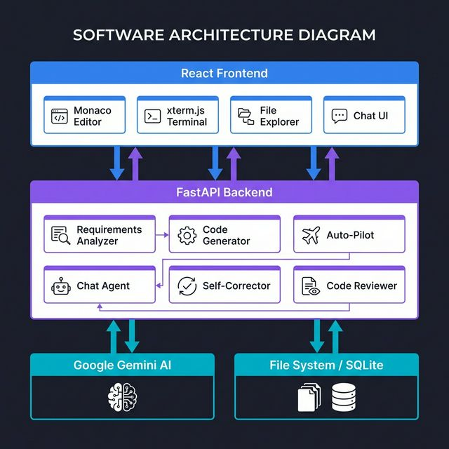
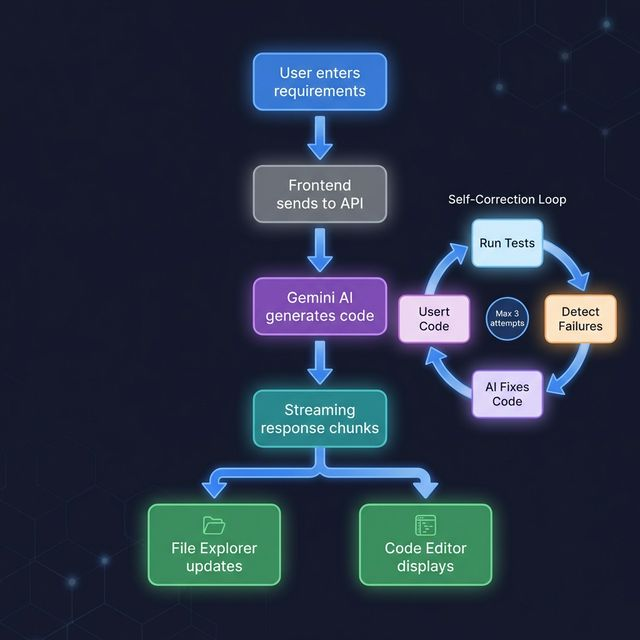
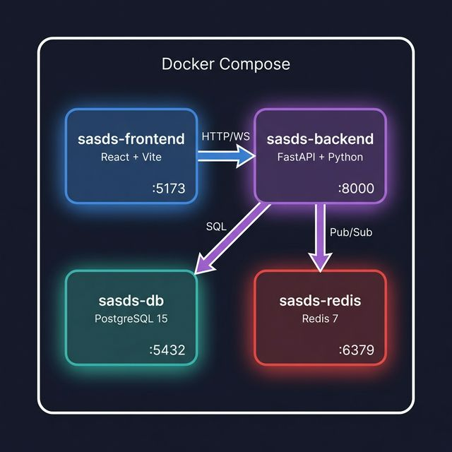
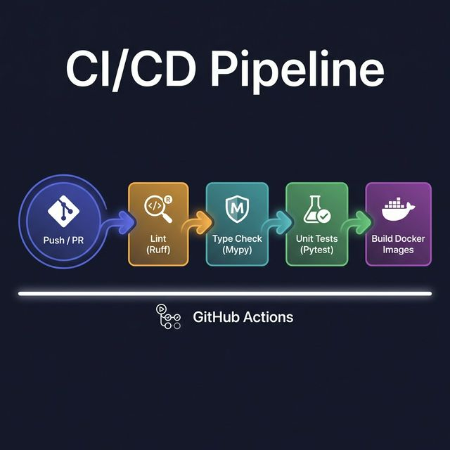

# 🏗️ System Architecture

> SASDS — Single Agent Software Development System

---

## Overview

SASDS is a full-stack, AI-powered IDE that transforms natural language into working software. The system follows a **layered architecture** with clear separation between the presentation layer, API gateway, AI service layer, and storage.

---

## High-Level Architecture



---

## Component Details

### 1. Frontend Application

| Component | Technology | Responsibility |
|---|---|---|
| **App Shell** | React 18 + Vite | Layout orchestration, state management, routing |
| **Monaco Editor** | `@monaco-editor/react` | Code editing with syntax highlighting (50+ languages) |
| **File Explorer** | Custom React component | Recursive file tree rendering, context menus, CRUD ops |
| **Terminal** | xterm.js + `xterm-addon-fit` | Full PTY terminal emulation over WebSocket |
| **Chat Interface** | Custom React component | Conversational AI with markdown rendering |
| **UI Primitives** | Shadcn/UI (Radix) | Buttons, cards, context menus, and layout components |

### 2. API Gateway (FastAPI)

| Feature | Implementation |
|---|---|
| **Framework** | FastAPI 0.109+ with Uvicorn ASGI server |
| **Protocol** | REST (HTTP) + WebSocket (Terminal) |
| **CORS** | Open CORS policy (configurable) |
| **Logging** | Request/response logging middleware with timing |
| **Error Handling** | Global exception handler with structured JSON errors |
| **Health Check** | `GET /ping` endpoint |

### 3. AI Service Layer

| Service | File | Key Function | Description |
|---|---|---|---|
| **Requirements Analyzer** | `gemini_client.py` | `analyze_requirements_with_gemini()` | Parses NL into modules, entities, APIs, tech stack |
| **Code Generator** | `code_generator.py` | `generate_code_with_gemini_stream()` | Streams generated files using `### FILE:` delimiter protocol |
| **Test Generator** | `test_generator.py` | `generate_tests()` | Creates pytest-compatible test files |
| **Code Reviewer** | `code_reviewer.py` | `review_code()` | Returns structured review with severity-rated issues |
| **Self-Corrector** | `self_corrector.py` | `run_self_correction()` | Iterative test-fix loop (max 3 attempts) |
| **Auto-Pilot** | `auto_pilot.py` | `analyze_project_structure()` | Full project scan for bugs, security, improvements |
| **Chat Agent** | `chat_agent.py` | `chat_with_agent()` | Context-aware conversational assistant |
| **Code Refiner** | `code_generator.py` | `refine_code_with_gemini()` | Targeted modifications to existing files |

### 4. Storage Layer

| Store | Technology | Data |
|---|---|---|
| **Generated Projects** | Local File System | Generated source code files organized by `project_id` |
| **Metadata** | SQLite (default) | Project metadata, run history, timestamps |
| **Persistent Data** | PostgreSQL (Docker) | Optional relational storage for production |
| **Task Queue** | Redis | Background job processing via Celery |

---

## Data Flow Diagrams

### Code Generation Flow (Streaming)

```
  User              Frontend           Backend API        Gemini AI          File System
   │                   │                   │                  │                  │
   │ Enter requirements │                   │                  │                  │
   ├──────────────────►│                   │                  │                  │
   │                   │  POST /analyze    │                  │                  │
   │                   ├──────────────────►│                  │                  │
   │                   │                   │  Analyze prompt  │                  │
   │                   │                   ├─────────────────►│                  │
   │                   │                   │ Structured JSON  │                  │
   │                   │                   │◄─────────────────┤                  │
   │                   │  Analysis result  │                  │                  │
   │                   │◄──────────────────┤                  │                  │
   │                   │                   │                  │                  │
   │ Click "Generate"  │                   │                  │                  │
   ├──────────────────►│                   │                  │                  │
   │                   │ POST /stream      │                  │                  │
   │                   ├──────────────────►│ Code gen prompt  │                  │
   │                   │                   ├─────────────────►│                  │
   │                   │                   │                  │                  │
   │                   │    ┌──────────── Streaming Loop ──────────────┐         │
   │                   │    │ Gemini AI ──► Backend ──► Frontend      │         │
   │                   │    │ (text chunk)  (SSE)      (parse & show) │         │
   │                   │    └─────────────────────────────────────────┘         │
   │                   │                   │                  │                  │
   │                   │  POST /files/create│                 │                  │
   │                   ├──────────────────►│ Write files      │                  │
   │                   │                   ├─────────────────────────────────────►│
   │                   │                   │                  │     Success      │
   │                   │   File created    │◄─────────────────────────────────────┤
   │                   │◄──────────────────┤                  │                  │
```

### Self-Correction Flow



```
  ┌─────────────────────────────────────────────────────────┐
  │                SELF-CORRECTION LOOP                     │
  │                                                         │
  │  ┌──────────┐     ┌──────────────┐    ┌──────────────┐  │
  │  │ Run      │────►│ All Tests    │YES │ ✅ Return    │  │
  │  │ Pytest   │     │ Pass?        │───►│   Success    │  │
  │  └──────────┘     └──────┬───────┘    └──────────────┘  │
  │       ▲                  │ NO                           │
  │       │                  ▼                              │
  │       │           ┌──────────────┐                      │
  │       │           │ Detect       │                      │
  │       │           │ Failing File │                      │
  │       │           └──────┬───────┘                      │
  │       │                  ▼                              │
  │       │           ┌──────────────┐                      │
  │       │           │ Read File    │                      │
  │       │           │ Content      │                      │
  │       │           └──────┬───────┘                      │
  │       │                  ▼                              │
  │       │           ┌──────────────┐                      │
  │       │           │ Send to      │                      │
  │       │           │ Gemini AI    │                      │
  │       │           └──────┬───────┘                      │
  │       │                  ▼                              │
  │       │           ┌──────────────┐                      │
  │       └───────────│ Write Fixed  │                      │
  │   (max 3 attempts)│ Code         │                      │
  │                   └──────────────┘                      │
  └─────────────────────────────────────────────────────────┘
```

### Terminal WebSocket Flow

```
  User         xterm.js       WebSocket      Python PTY      Shell
   │               │               │               │            │
   │ Connect       │               │               │            │
   ├──────────────►│ WS handshake  │               │            │
   │               ├──────────────►│ Spawn PTY     │            │
   │               │               ├──────────────►│ Start shell │
   │               │               │               ├───────────►│
   │               │               │               │            │
   │    ┌────────── Interactive Session Loop ───────────────┐   │
   │    │                                                   │   │
   │    │  User ──► xterm.js ──► WebSocket ──► PTY ──► Shell│   │
   │    │  (keypress) (input)     (stdin)      (exec)       │   │
   │    │                                                   │   │
   │    │  Shell ──► PTY ──► WebSocket ──► xterm.js ──► User│   │
   │    │  (output)  (stdout)  (send)     (render)          │   │
   │    │                                                   │   │
   │    └───────────────────────────────────────────────────┘   │
   │               │               │               │            │
```

---

## Infrastructure

### Container Architecture



| Container | Image | Port | Purpose |
|---|---|---|---|
| `sasds-frontend` | Node 18-alpine | 5173 | React app (Vite dev server / Nginx prod) |
| `sasds-backend` | Python 3.9-slim | 8000 | FastAPI + Uvicorn |
| `sasds-db` | postgres:15-alpine | 5432 | Persistent relational storage |
| `sasds-redis` | redis:7-alpine | 6379 | Task queue & caching |

### CI/CD Pipeline



---

## Security Architecture

| Concern | Implementation |
|---|---|
| **API Key Management** | Environment variables via `.env` (never committed) |
| **CORS Policy** | Configurable origins (default: open for development) |
| **Input Validation** | Pydantic models for all request/response schemas |
| **Error Isolation** | Global exception handler prevents stack trace leakage |
| **File System Sandboxing** | Generated projects isolated to `generated_projects/` directory |
| **WebSocket Security** | Per-session PTY with process isolation |
