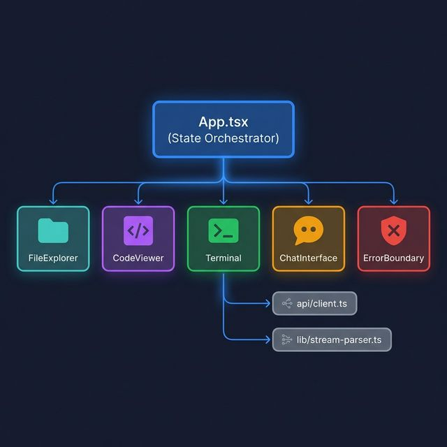

# 🔧 Technical Design Document

> SASDS — Deep-Dive Technical Specification

---

## 1. Directory Structure

```
SASDS-AI-Automation/
├── backend/
│   ├── app/
│   │   ├── core/               # Configuration & settings
│   │   │   └── config.py       # Environment variable management
│   │   ├── db/                 # Database models & connections
│   │   ├── routers/            # API route handlers (13 routers)
│   │   │   ├── autopilot.py    # Auto-pilot analysis trigger
│   │   │   ├── chat.py         # Chat agent endpoint
│   │   │   ├── code_writer.py  # Direct file writing
│   │   │   ├── codegen.py      # Code generation (batch + stream)
│   │   │   ├── files.py        # File system CRUD operations
│   │   │   ├── github_sync.py  # GitHub repository sync
│   │   │   ├── projects.py     # Project management
│   │   │   ├── refine.py       # Code refinement
│   │   │   ├── requirements.py # Requirements analysis
│   │   │   ├── review.py       # Code review
│   │   │   ├── runs.py         # Execution run history
│   │   │   ├── self_corrector.py # Self-correction trigger
│   │   │   ├── terminal.py     # WebSocket terminal service
│   │   │   └── test_generator.py # Test generation
│   │   ├── schemas/            # Pydantic request/response models
│   │   ├── services/           # Business logic & AI integration
│   │   │   ├── auto_pilot.py   # Project analysis via Gemini
│   │   │   ├── chat_agent.py   # Conversational AI agent
│   │   │   ├── code_generator.py # Code gen (batch, stream, refine)
│   │   │   ├── code_reviewer.py  # Structured code review
│   │   │   ├── fix_generator.py  # Bug fix generation
│   │   │   ├── gemini_client.py  # Requirements analysis
│   │   │   ├── github_sync.py    # GitHub API integration
│   │   │   ├── metadata_store.py # SQLite metadata operations
│   │   │   ├── self_corrector.py # Iterative test-fix loop
│   │   │   └── test_generator.py # Test file generation
│   │   └── utils/              # Shared utilities
│   ├── tests/                  # Pytest test suite
│   ├── generated_projects/     # Generated project output directory
│   ├── Dockerfile              # Backend container definition
│   ├── requirements.txt        # Python dependencies
│   └── pyproject.toml          # Project metadata
│
├── frontend/
│   ├── src/
│   │   ├── components/         # React UI components
│   │   │   ├── CodeViewer.tsx   # Monaco Editor wrapper
│   │   │   ├── FileExplorer.tsx # Recursive file tree
│   │   │   ├── Terminal.tsx     # xterm.js wrapper
│   │   │   ├── ChatInterface.tsx # AI chat panel
│   │   │   ├── ErrorBoundary.tsx # React error boundary
│   │   │   └── ui/             # Shadcn/UI primitives
│   │   ├── api/
│   │   │   └── client.ts       # HTTP & streaming API client
│   │   ├── lib/
│   │   │   ├── utils.ts        # Utility functions (cn, etc.)
│   │   │   ├── stream-parser.ts # Streaming delimiter parser
│   │   │   └── file-utils.ts   # File tree builder
│   │   ├── App.tsx             # Main application & state orchestrator
│   │   ├── types.ts            # TypeScript interfaces
│   │   └── main.tsx            # Application entry point
│   ├── Dockerfile              # Frontend container definition
│   ├── nginx.conf              # Production Nginx config
│   ├── vite.config.ts          # Vite build configuration
│   └── tailwind.config.cjs     # Tailwind theme configuration
│
├── docs/                       # Project documentation
├── .github/workflows/ci.yml    # CI/CD pipeline
├── docker-compose.yml          # Multi-container orchestration
└── README.md                   # Project overview
```

---

## 2. AI Agent Pipeline Design

### 2.1 Requirements Analysis

**Input:** Natural language string
**Output:** Structured JSON

```
User Text → Gemini Prompt → JSON Response → Pydantic Validation
```

The analyzer extracts:
- **Modules**: Logical groupings of functionality
- **Entities**: Data models with attributes
- **APIs**: REST endpoint specifications
- **Non-Functional Requirements**: Performance, scalability, security
- **Tech Stack Suggestions**: Recommended technologies
- **Missing Information**: Gaps requiring clarification

### 2.2 Code Generation (Streaming Protocol)

SASDS uses a **custom delimiter protocol** for real-time code streaming:

```
### FILE: backend/app/main.py
<file content line 1>
<file content line 2>
...
### END FILE ###

### FILE: backend/app/models/user.py
<file content>
### END FILE ###
```

**Why not JSON streaming?** JSON requires complete parsing before rendering. The delimiter protocol allows the frontend to:
1. Detect file boundaries incrementally
2. Update the file explorer in real-time
3. Display code as it's being generated (token by token)

### 2.3 Self-Correction Algorithm

```
function self_correct(project_path, max_attempts=3):
    for attempt in 1..max_attempts:
        result = run_pytest(project_path)

        if result.passed:
            return SUCCESS

        failing_file = parse_pytest_output(result.output)

        if not failing_file:
            return CANNOT_DETECT_FILE

        original_code = read_file(failing_file)
        fixed_code = gemini.generate_fix(
            file=failing_file,
            code=original_code,
            error=result.output
        )

        write_file(failing_file, fixed_code)

    return MAX_ATTEMPTS_REACHED
```

**Key design decisions:**
- Maximum 3 attempts prevents infinite loops
- Failing file detection uses regex on pytest output
- Only the failing file is sent to Gemini (not the entire project) to reduce token usage
- The fix is written directly to disk for the next test run

### 2.4 Auto-Pilot Analysis

The Auto-Pilot reads **all project files** and sends them as context to Gemini for holistic analysis:

| Scanned | Ignored |
|---|---|
| `.py`, `.js`, `.ts`, `.tsx`, `.html`, `.css`, `.md`, `.json` | `node_modules/`, `.venv/`, `.git/`, `__pycache__/` |
| Files under 50KB | Files over 50KB (marked as `<file too large>`) |

**Output structure:**
- `summary`: High-level project health assessment
- `issues[]`: Severity-rated (high/medium/low) findings with file, line, description, and suggestion
- `improvements[]`: Categorized (refactor/feature/security) enhancement recommendations

---

## 3. State Management Architecture



```
  ┌────────────────────────────────────────────────────────┐
  │              App.tsx (State Orchestrator)               │
  │                                                        │
  │  requirementsState   codeState   streamState           │
  │  (input, analysis)   (files[])   (buffer ref)          │
  │                                                        │
  │  editorState         terminalState   autoPilotState     │
  │  (selected, tabs)    (WebSocket)     (analysis)         │
  │                                                        │
  │  chatState                                             │
  │  (message history)                                     │
  └────────┬───────────┬───────────┬───────────┬───────────┘
           │           │           │           │
     ┌─────▼─────┐ ┌──▼──────┐ ┌─▼────────┐ ┌▼────────────┐
     │FileExplorer│ │CodeViewer│ │ Terminal │ │ChatInterface│
     │onSelect()  │ │onChange()│ │ (WS)     │ │sendMessage()│
     └───────────┘ └─────────┘ └──────────┘ └─────────────┘
```

**Design rationale:** All state lives in `App.tsx` as a single source of truth. Components are purely presentational and communicate via callbacks. This avoids the complexity of Redux/Zustand for a single-page application.

---

## 4. API Design Patterns

### Request/Response Convention

All API endpoints follow consistent patterns:

```python
# Router pattern
@router.post("/endpoint", response_model=ResponseSchema)
async def handler(request: RequestSchema):
    result = service_function(request.data)
    return result
```

### Error Response Format

```json
{
    "detail": "Human-readable error message",
    "exception": "Technical error details (dev mode only)"
}
```

### Streaming Response (SSE)

Code generation uses `StreamingResponse` with `text/plain` content type:
```python
return StreamingResponse(
    generate_code_with_gemini_stream(requirements),
    media_type="text/plain"
)
```

---

## 5. Configuration Management

All configuration is managed via environment variables loaded through `python-dotenv`:

| Variable | Required | Default | Description |
|---|---|---|---|
| `GEMINI_API_KEY` | ✅ Yes | — | Google Gemini API authentication key |
| `GEMINI_MODEL_NAME` | No | `models/gemini-2.5-flash` | Model to use for all AI operations |
| `DB_URL` | No | `sqlite:///./metadata.sqlite` | Database connection string |
| `GITHUB_TOKEN` | No | — | GitHub personal access token for sync |
| `GITHUB_REPO` | No | — | Target GitHub repo (format: `owner/repo`) |
| `GITHUB_BRANCH` | No | `main` | Target branch for GitHub sync |

---

## 6. Error Handling Strategy

| Layer | Strategy |
|---|---|
| **Frontend** | `ErrorBoundary` component catches React rendering errors |
| **API Gateway** | Global HTTP middleware catches unhandled exceptions |
| **AI Services** | Try/catch with `HTTPException` for known errors |
| **Gemini API** | JSON parse validation after every AI response |
| **WebSocket** | Per-connection error handling with graceful disconnect |
| **Self-Corrector** | Max-attempt guard prevents infinite fix loops |
